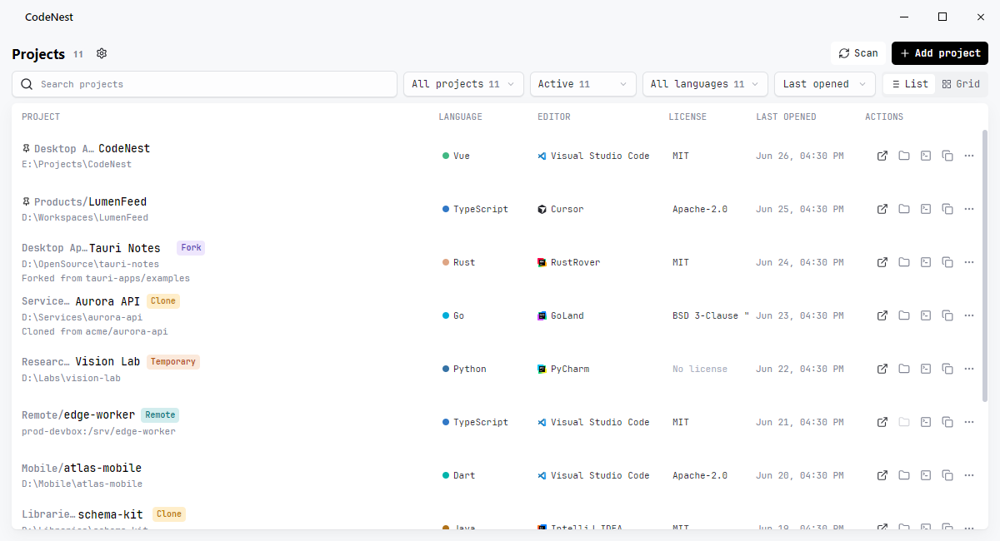

<div align="center">

# CodeNest

A desktop application for managing local and remote development projects

[](LICENSE.txt)
[](https://github.com/MidnightCrowing/CodeNest/releases)
[](https://github.com/MidnightCrowing/CodeNest/releases)

English · <a href="README_CN.md">简体中文</a>



</div>

CodeNest records development projects stored on local disks, remote SSH hosts, or separate workspaces. It stores project groups, project types, source repositories, default editors, language metadata, and license metadata, then lets you open projects or locate their paths from the home view.

## Features

- Record local projects and remote SSH projects with groups, project types, source repositories, default editors, license information, and language information.
- Configure project roots or import projects from recent-project records of supported editors and CLI tools.
- Analyze project language composition, read license snippets, and show the results in the project list and editor view.
- Use launch configurations for multiple editors and CLI tools, with custom command templates.
- Open a project from the project list, reveal it in the file manager, open it in a terminal, copy its path, or open its source repository link.
- Manually upload or download project data through WebDAV. Downloads create a local backup first.

## Installation

Download the installer for your system from the [Releases](https://github.com/MidnightCrowing/CodeNest/releases) page.

<sub>⚠️ On macOS, if the app says it is damaged and cannot be opened, move it to Applications and run: `sudo xattr -rd com.apple.quarantine /Applications/CodeNest.app`.</sub>

<table>
<thead>
<tr>
<th>Operating System</th>
<th>Minimum Version</th>
<th>Architecture</th>
<th>Package Format</th>
</tr>
</thead>
<tbody>
<tr>
<td><strong>Windows</strong></td>
<td>Windows 10</td>
<td>x64</td>
<td>MSI</td>
</tr>
<tr>
<td><strong>macOS</strong></td>
<td>macOS 11 (Big Sur)</td>
<td>Intel / Apple Silicon</td>
<td>DMG</td>
</tr>
<tr>
<td><strong>Linux</strong></td>
<td>Ubuntu 20.04 / Fedora 36</td>
<td>x64</td>
<td>AppImage / deb / rpm</td>
</tr>
</tbody>
</table>

## Quick Start

### Add a Project
Click the "Add project" button and select a project directory. After adding it, you can analyze languages and read license snippets, or manually set the project type, source repository, and default editor.

### Batch Import
Navigate to "Settings > Scanner", configure directories to scan or enable IDE history import, then return to home and click the scan button to batch add projects.

### Open Project
Click a project item or use the action bar buttons:
- Open in specified IDE
- Show in file manager
- Open in terminal
- Copy project path

### Data Sync
Configure WebDAV server information in "Settings > Data" to manually upload or download project lists and settings.

## Development

### Requirements
- Node.js 20+
- Rust stable
- pnpm 11+

### Getting Started

```bash
# Install dependencies
pnpm install

# Start dev server
pnpm dev

# Run all checks
pnpm check

# Build application
pnpm build:exe    # Executable only
pnpm build        # With installer
```

### Project Structure

```
codenest/
├── src/              # Vue frontend
│   ├── views/        # Page components
│   ├── stores/       # Pinia state
│   ├── components/   # Reusable components
│   └── services/     # Business logic
├── src-tauri/        # Rust backend
│   └── src/          # Tauri commands
└── tests/            # Test files
```

For more development guidance, see [CLAUDE.md](CLAUDE.md) and [CONTRIBUTING.md](docs/CONTRIBUTING_EN.md).

## Feedback & Contributing

Report issues or suggest features via [GitHub Issues](https://github.com/MidnightCrowing/CodeNest/issues).

If you'd like to contribute code, please read the [Contributing Guide](docs/CONTRIBUTING_EN.md) first.

## License

[MIT License](LICENSE.txt) © 2024 MidnightCrowing

## Acknowledgments

This project uses the following excellent open source projects:

- [Tauri](https://tauri.app/) - Cross-platform desktop app framework
- [Vue](https://vuejs.org/) - Progressive JavaScript framework
- [Reka UI](https://reka-ui.com/) - Unstyled component library
- [UnoCSS](https://unocss.dev/) - Instant on-demand atomic CSS engine
- [Lucide](https://lucide.dev/) - Open source icon library

And editor icon resources provided by JetBrains, Microsoft, Anthropic and others.
