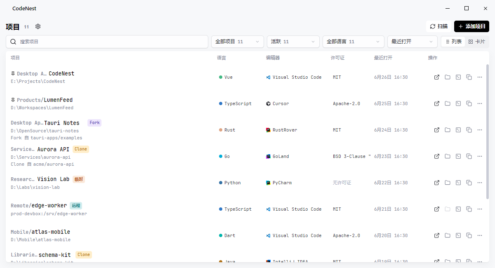

<div align="center">

# CodeNest

用于管理本地和远程开发项目的桌面应用

[](LICENSE.txt)
[](https://github.com/MidnightCrowing/CodeNest/releases)
[](https://github.com/MidnightCrowing/CodeNest/releases)

<a href="README.md">English</a> · 简体中文



</div>

CodeNest 用于集中记录分散在磁盘、远程 SSH 主机或不同工作区中的开发项目。你可以为项目维护分组、类型、来源仓库、默认编辑器、语言和许可证信息，并从首页打开项目或定位到项目路径。

## 功能

- 记录本地项目和远程 SSH 项目，维护分组、项目类型、来源仓库、默认编辑器、许可证和语言信息。
- 配置项目根目录，或从部分编辑器和 CLI 工具的最近项目记录中导入项目。
- 分析项目语言组成，读取许可证片段，并在项目列表和编辑页中展示相关信息。
- 使用多款编辑器和 CLI 工具的启动配置，也可以自定义打开命令。
- 从项目列表打开项目、在文件管理器中显示、在终端中打开、复制项目路径，或打开来源仓库链接。
- 手动上传或下载项目数据到 WebDAV 服务器；下载前会创建本地备份。

## 安装

从 [Releases](https://github.com/MidnightCrowing/CodeNest/releases) 页面下载适合你系统的安装包。

<sub>⚠️ macOS 如果提示“文件已损坏，无法打开”，请将应用拖入“应用程序”后运行：`sudo xattr -rd com.apple.quarantine /Applications/CodeNest.app`。</sub>

<table>
<thead>
<tr>
<th>操作系统</th>
<th>最低版本</th>
<th>架构</th>
<th>安装包格式</th>
</tr>
</thead>
<tbody>
<tr>
<td><strong>Windows</strong></td>
<td>Windows 10</td>
<td>x64</td>
<td>MSI</td>
</tr>
<tr>
<td><strong>macOS</strong></td>
<td>macOS 11 (Big Sur)</td>
<td>Intel / Apple Silicon</td>
<td>DMG</td>
</tr>
<tr>
<td><strong>Linux</strong></td>
<td>Ubuntu 20.04 / Fedora 36</td>
<td>x64</td>
<td>AppImage / deb / rpm</td>
</tr>
</tbody>
</table>

## 快速开始

### 添加项目
点击"添加项目"按钮，选择项目目录。添加后可以分析语言并读取许可证片段，也可以手动设置项目类型、来源仓库和默认编辑器。

### 批量导入
进入"设置 > 扫描器"，配置要扫描的目录或启用 IDE 历史导入，返回主页点击扫描按钮即可批量添加项目。

### 打开项目
点击项目条目，或使用操作栏中的按钮：
- 在指定 IDE 中打开
- 在文件管理器中显示
- 在终端中打开
- 复制项目路径

### 数据同步
在"设置 > 数据"中配置 WebDAV 服务器信息，可手动上传或下载项目列表和配置。

## 开发

### 环境要求
- Node.js 20+
- Rust stable
- pnpm 11+

### 快速开始

```bash
# 安装依赖
pnpm install

# 启动开发服务器
pnpm dev

# 运行所有检查
pnpm check

# 构建应用
pnpm build:exe    # 仅可执行文件
pnpm build        # 包含安装包
```

### 项目结构

```
codenest/
├── src/              # Vue 前端
│   ├── views/        # 页面组件
│   ├── stores/       # Pinia 状态
│   ├── components/   # 可复用组件
│   └── services/     # 业务逻辑
├── src-tauri/        # Rust 后端
│   └── src/          # Tauri 命令
└── tests/            # 测试文件
```

更多开发指南请参考 [CLAUDE.md](CLAUDE.md) 和 [CONTRIBUTING.md](docs/CONTRIBUTING_CN.md)。

## 反馈与贡献

欢迎通过 [GitHub Issues](https://github.com/MidnightCrowing/CodeNest/issues) 报告问题或提出建议。

如果你想贡献代码，请先阅读 [贡献指南](docs/CONTRIBUTING_CN.md)。

## 许可证

[MIT License](LICENSE.txt) © 2024 MidnightCrowing

## 致谢

本项目使用了以下优秀的开源项目：

- [Tauri](https://tauri.app/) - 跨平台桌面应用框架
- [Vue](https://vuejs.org/) - 渐进式 JavaScript 框架
- [Reka UI](https://reka-ui.com/) - 无样式组件库
- [UnoCSS](https://unocss.dev/) - 即时按需原子化 CSS 引擎
- [Lucide](https://lucide.dev/) - 开源图标库

以及 JetBrains、Microsoft、Anthropic 等公司提供的编辑器图标资源。
