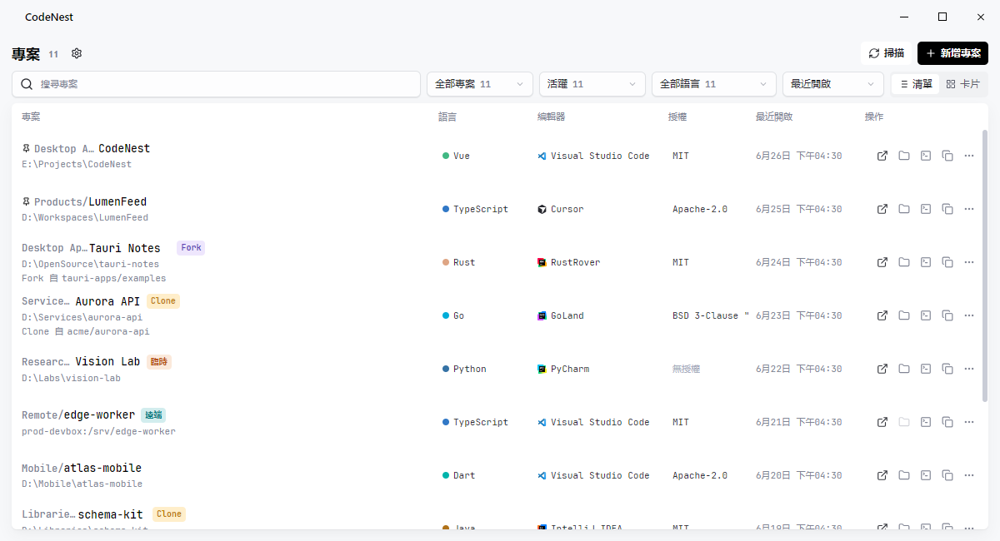

<div align="center">

# CodeNest

用於管理本機與遠端開發專案的桌面應用程式

[](LICENSE.txt)
[](https://github.com/MidnightCrowing/CodeNest/releases)
[](https://github.com/MidnightCrowing/CodeNest/releases)

<a href="README.md">English</a> · <a href="README_CN.md">简体中文</a> · 繁體中文



</div>

CodeNest 用於集中記錄分散在磁碟、遠端 SSH 主機或不同工作區中的開發專案。你可以為專案維護群組、類型、來源儲存庫、預設編輯器、語言和授權資訊，並從首頁開啟專案或定位到專案路徑。

## 功能

- 記錄本機專案和遠端 SSH 專案，維護群組、專案類型、來源儲存庫、預設編輯器、授權和語言資訊。
- 設定專案根目錄，或從部分編輯器和 CLI 工具的最近專案記錄中匯入專案。
- 分析專案語言組成，讀取授權片段，並在專案列表和編輯頁中顯示相關資訊。
- 使用多款編輯器和 CLI 工具的啟動設定，也可以自訂開啟命令。
- 從專案列表開啟專案、在檔案管理器中顯示、在終端機中開啟、複製專案路徑，或開啟來源儲存庫連結。
- 手動上傳或下載專案資料到 WebDAV 伺服器；下載前會建立本機備份。

## 安裝

從 [Releases](https://github.com/MidnightCrowing/CodeNest/releases) 頁面下載適合你系統的安裝套件。

<sub>⚠️ macOS 如果提示「檔案已損毀，無法開啟」，請將應用程式拖入「應用程式」後執行：`sudo xattr -rd com.apple.quarantine /Applications/CodeNest.app`。</sub>

<table>
<thead>
<tr>
<th>作業系統</th>
<th>最低版本</th>
<th>架構</th>
<th>安裝套件格式</th>
</tr>
</thead>
<tbody>
<tr>
<td><strong>Windows</strong></td>
<td>Windows 10</td>
<td>x64</td>
<td>MSI</td>
</tr>
<tr>
<td><strong>macOS</strong></td>
<td>macOS 11 (Big Sur)</td>
<td>Intel / Apple Silicon</td>
<td>DMG</td>
</tr>
<tr>
<td><strong>Linux</strong></td>
<td>Ubuntu 20.04 / Fedora 36</td>
<td>x64</td>
<td>AppImage / deb / rpm</td>
</tr>
</tbody>
</table>

## 快速開始

### 新增專案
點選「新增專案」按鈕，選擇專案目錄。新增後可以分析語言並讀取授權片段，也可以手動設定專案類型、來源儲存庫和預設編輯器。

### 批次匯入
進入「設定 > 掃描器」，設定要掃描的目錄或啟用 IDE 歷史匯入，返回首頁點選掃描按鈕即可批次新增專案。

### 開啟專案
點選專案項目，或使用操作列中的按鈕：
- 在指定 IDE 中開啟
- 在檔案管理器中顯示
- 在終端機中開啟
- 複製專案路徑

### 資料同步
在「設定 > 資料」中設定 WebDAV 伺服器資訊，可手動上傳或下載專案列表和設定。

## 開發

### 環境需求
- Node.js 20+
- Rust stable
- pnpm 11+

### 快速開始

```bash
# 安裝依賴
pnpm install

# 啟動開發伺服器
pnpm dev

# 執行所有檢查
pnpm check

# 建置應用程式
pnpm build:exe    # 僅可執行檔
pnpm build        # 包含安裝套件
```

### 專案結構

```
codenest/
├── src/              # Vue 前端
│   ├── views/        # 頁面元件
│   ├── stores/       # Pinia 狀態
│   ├── components/   # 可重用元件
│   └── services/     # 業務邏輯
├── src-tauri/        # Rust 後端
│   └── src/          # Tauri 命令
└── tests/            # 測試檔案
```

更多開發指南請參考 [CLAUDE.md](CLAUDE.md) 和 [CONTRIBUTING.md](docs/CONTRIBUTING_CN.md)。

## 回饋與貢獻

歡迎透過 [GitHub Issues](https://github.com/MidnightCrowing/CodeNest/issues) 回報問題或提出建議。

如果你想貢獻程式碼，請先閱讀 [貢獻指南](docs/CONTRIBUTING_CN.md)。

## 授權

[MIT License](LICENSE.txt) © 2024 MidnightCrowing

## 致謝

本專案使用了以下優秀的開源專案：

- [Tauri](https://tauri.app/) - 跨平台桌面應用程式框架
- [Vue](https://vuejs.org/) - 漸進式 JavaScript 框架
- [Reka UI](https://reka-ui.com/) - 無樣式元件庫
- [UnoCSS](https://unocss.dev/) - 即時按需原子化 CSS 引擎
- [Lucide](https://lucide.dev/) - 開源圖示庫

以及 JetBrains、Microsoft、Anthropic 等公司提供的編輯器圖示資源。

## 友情連結

- [LINUX DO](https://linux.do/)
